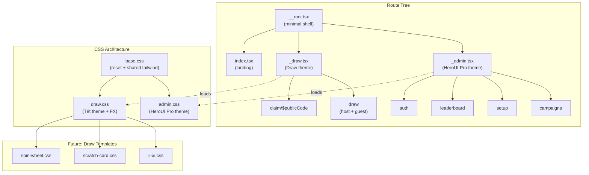

# Tách Style System: HeroUI Pro (Admin) vs Custom Themed (Draw Experience)

## Background: HeroUI Pro là gì?

HeroUI **chính là NextUI, đã đổi tên** để tránh nhầm lẫn với Vercel Next.js. Component library, team, architecture đều giống nhau.

- **HeroUI** (free, open-source) = ~30+ atomic components (Button, Input, Modal, Table, etc.)
- **HeroUI Pro** (paid, one-time purchase) = 48+ advanced components (DataGrid, Sidebar, AppLayout, Charts, Command Palette, etc.)
- **HeroUI v3 dùng Tailwind CSS v4** natively — CSS-first config, `@import` approach
- **CSS theming** qua CSS variables + `data-theme` attribute scoping
- **Không cần Framer Motion** — v3 dùng CSS animations

> [!NOTE]
> **Current package state**: Project hiện đã có `@heroui-pro/react`, `@heroui/react`, và `@heroui/styles` trong `package.json`. Kế hoạch dưới đây là ngữ cảnh lịch sử cho quá trình tách UI domain, không còn là checklist cài dependency.

## Problem

Trạng thái cũ của app là toàn bộ route dùng chung [globals.css](file:///home/terasumi/Documents/source_code/Web/li-xi/app/globals.css) và trộn:
- CSS tokens/variables cho theme Tết (red-deep, gold-shine, etc.)
- Tailwind theme extensions (`@theme` block)
- Keyframes animation cho draw experience (envelope card, legendary FX, regret effects)
- Base styles (body background, font defaults)
- Utility classes (noise-overlay, custom-scrollbar, burst-ring, spark, etc.)

Trạng thái hiện tại đã tách domain CSS thành `app/styles/base.css`, `app/styles/admin.css`, và `app/styles/draw.css`; route head load CSS theo từng surface thay vì import global stylesheet từ [__root.tsx](file:///home/terasumi/Documents/source_code/Web/li-xi/app/__root.tsx).

Khi chuyển admin sang HeroUI Pro:
- HeroUI Pro dùng Tailwind CSS v4 + theme tokens riêng (oklch colors, Plus Jakarta Sans font, etc.)
- Draw experience cần giữ custom theme Tết (Cinzel Decorative, Playfair Display, red/gold palette)
- 2 hệ thống CSS sẽ xung đột nếu load chung globally

> [!CAUTION]
> **CSS Variable Collision**: Không đưa lại semantic/admin tokens như `--background`, `--foreground`, `--primary`, `--card`, `--popover`, `--muted`, hoặc `--sidebar-*` vào `app/styles/draw.css`. Draw CSS chỉ nên giữ token red/gold và animation/template utilities của trải nghiệm khách.

> [!IMPORTANT]
> Mục tiêu là **2 layout domains riêng biệt**: admin routes dùng HeroUI Pro theme, draw/claim routes dùng custom theme. Không được để style leak giữa 2 domain.

## Historical User Review Items

> [!IMPORTANT]
> **Quyết định cần xác nhận:**
> 1. **Dashboard page (`/draw` host mode)** — Host dashboard hiện đang dùng custom theme ([HostShell](file:///home/terasumi/Documents/source_code/Web/li-xi/app/draw/components/HostShell.tsx) với red/gold gradient). Chuyển host dashboard sang HeroUI Pro luôn, hay giữ riêng?
> 2. **Auth page (`/auth`)** — Chuyển sang HeroUI Pro không? Hay giữ custom vì là first impression?
> 3. **HeroUI Pro theme** — Dark mode, light mode, hay auto (system preference)?
> 4. **Draw template mới** — Mỗi template (lì xì, cào, quay, ...) có CSS hoàn toàn riêng, hay share base framework rồi override?
> 5. **Font cho admin** — HeroUI Pro mặc định dùng Plus Jakarta Sans (đã có trong `globals.css`). Giữ font đó hay đổi?

## Open Questions

> [!WARNING]
> **HeroUI Pro beta status**: Package `@heroui-pro/react@^1.0.0-beta.4` đang ở beta. Cần xác nhận:
> - Bạn đã có license/access cho HeroUI Pro chưa?
> - Có documentation/examples cụ thể nào bạn đang tham khảo không?
> - HeroUI Pro có components nào bạn đặc biệt muốn dùng? (Table, Form, Sidebar, Dashboard layout, etc.)

## Proposed Changes

### Strategy: Dual Layout Architecture

Dùng **TanStack Router layout routes** để tạo 2 layout domains hoàn toàn tách biệt:

```
__root.tsx          ← Minimal: chỉ <html>, <head>, <body>, ConvexClientProvider
├── _admin.tsx      ← Layout route: load HeroUI Pro CSS + theme provider
│   ├── campaigns.tsx
│   ├── setup.tsx
│   ├── leaderboard.tsx
│   └── auth.tsx (?)
├── _draw.tsx       ← Layout route: load draw theme CSS + draw fonts
│   └── draw.tsx    ← Host dashboard + guest FortuneStage
├── claim/
│   └── $publicCode.tsx  ← Cũng dùng draw theme (FortuneStage)
└── index.tsx       ← Landing page
```

---

### Phase 1: CSS Splitting

#### [MODIFY] [globals.css](file:///home/terasumi/Documents/source_code/Web/li-xi/app/globals.css)
Tách thành 3 files:

#### [NEW] `app/styles/base.css`
- `@import "tailwindcss"` 
- Minimal reset (box-sizing, margin/padding)
- **Không** set body background, font, color mặc định
- **Không** define semantic tokens (`--background`, `--primary`, etc.) — để mỗi domain tự define

#### [NEW] `app/styles/admin.css`
```css
@import "./base.css";
@import "@heroui/styles";        /* HeroUI base theme tokens */
@import "@heroui-pro/react/css";  /* Pro component styles */

/* Admin-specific overrides */
:root {
  /* HeroUI tokens win here — no Tết palette */
}
.dark {
  /* Dark mode admin overrides */
}
```
- HeroUI theme tokens replace the oklch variables from current `globals.css`
- Plus Jakarta Sans font stack (already defined in current globals)
- Admin layout utilities (sidebar, topbar, etc.)

#### [NEW] `app/styles/draw.css`  
- `@import "./base.css"`
- Toàn bộ Tết theme tokens (`--color-red-deep`, `--color-gold-shine`, etc.)
- Draw-specific fonts trong `@theme` (Cinzel, Playfair, Noto Serif)
- Tất cả keyframes (float-slow, regret-*, legend-glow, etc.)
- Utility classes (noise-overlay, custom-scrollbar, burst FX, etc.)
- Body background/color defaults cho draw context

#### [DELETE] `app/globals.css` ← Replaced by the 3 files above

---

### Phase 2: Layout Routes

#### [MODIFY] [__root.tsx](file:///home/terasumi/Documents/source_code/Web/li-xi/app/__root.tsx)
- Bỏ import `globals.css`
- Chỉ giữ ConvexClientProvider, minimal `<html>`, `<head>`, `<body>`
- Bỏ Google Fonts link (chuyển vào draw layout)

#### [NEW] `app/_admin.tsx`
Layout route cho tất cả admin pages:
```tsx
import adminCss from "../styles/admin.css?url";

export const Route = createFileRoute("/_admin")({
  component: AdminLayout,
  head: () => ({
    links: [
      { rel: "stylesheet", href: adminCss },
      // HeroUI Pro fonts (Plus Jakarta Sans, etc.)
    ],
  }),
});

function AdminLayout() {
  return (
    <HeroUIProvider> {/* nếu HeroUI Pro cần provider */}
      <div className="admin-shell">
        {/* Sidebar, topbar, etc. */}
        <Outlet />
      </div>
    </HeroUIProvider>
  );
}
```

#### [NEW] `app/_draw.tsx`
Layout route cho draw experience:
```tsx
import drawCss from "../styles/draw.css?url";

export const Route = createFileRoute("/_draw")({
  component: DrawLayout,
  head: () => ({
    links: [
      { rel: "stylesheet", href: drawCss },
      // Tết fonts (Cinzel, Playfair, Noto Serif)
      { rel: "preconnect", href: "https://fonts.googleapis.com" },
      { rel: "stylesheet", href: "https://fonts.googleapis.com/css2?family=..." },
    ],
  }),
});

function DrawLayout() {
  return <Outlet />;
}
```

---

### Phase 3: Route Migration

#### [MODIFY] `app/campaigns.tsx` → `app/_admin/campaigns.tsx`
- Thay `HostShell`, `HostHeader` → HeroUI Pro layout components
- Dùng HeroUI Pro Table, Form, Button, Modal, etc.
- Giữ business logic nguyên vẹn, chỉ đổi presentation layer

#### [MODIFY] `app/setup.tsx` → `app/_admin/setup.tsx`
- Thay custom styled form → HeroUI Pro Form/Input/Select components

#### [MODIFY] `app/leaderboard.tsx` → `app/_admin/leaderboard.tsx`
- Thay custom table → HeroUI Pro Table/DataGrid

#### [MODIFY] `app/draw.tsx` → `app/_draw/draw.tsx`
- Giữ nguyên hoặc chỉ refactor nhỏ
- HostShell, FortuneStage vẫn dùng draw theme

#### [MODIFY] `app/claim/$publicCode.tsx` → `app/_draw/claim/$publicCode.tsx`
- Giữ nguyên, dùng draw theme

---

### Phase 4: Draw Template System (cho tương lai)

Chuẩn bị kiến trúc cho nhiều mẫu rút:

#### [NEW] `app/draw/templates/` directory structure
```
app/draw/templates/
├── li-xi/              ← Mẫu lì xì hiện tại
│   ├── li-xi.css       ← Theme CSS riêng (Tết red/gold)
│   ├── FortuneStage.tsx
│   ├── EnvelopeCard.tsx
│   ├── ResultModal.tsx
│   ├── HeroSection.tsx
│   └── legendaryFx.ts
├── scratch-card/       ← Mẫu cào (tương lai)
│   ├── scratch-card.css
│   ├── ScratchStage.tsx
│   └── ...
└── spin-wheel/         ← Mẫu quay (tương lai)
    ├── spin-wheel.css
    ├── SpinStage.tsx
    └── ...
```

Mỗi template export một `DrawTemplate` interface:
```tsx
interface DrawTemplate {
  Stage: React.ComponentType<DrawStageProps>;
  css: string; // CSS URL to load dynamically
  fonts?: FontLink[]; // Google Fonts or local fonts
}
```

#### [NEW] `app/draw/templates/registry.ts`
Registry tập trung cho tất cả templates. Draw layout route sẽ load CSS của template active dựa trên campaign config.

---

### Phase 5: Design System Documentation

#### [MODIFY] [design_system.md](file:///home/terasumi/Documents/source_code/Web/li-xi/design_system.md)
- Rename thành "Draw Template: Lunar Fortune Design System"
- Clarify rằng document này chỉ áp dụng cho draw experience, không phải admin
- Thêm section về admin design direction (reference HeroUI Pro)

#### [NEW] `docs/admin-design-system.md`
- Document admin UI direction: HeroUI Pro components, theme tokens, layout patterns
- Reference HeroUI Pro documentation

---

## Architecture Diagram



## Verification Plan

### Automated Tests
1. **Existing contract tests** pass: `npm run test:contracts`
2. **Smoke routes** pass: `npm run test:smoke`  
3. **Typecheck** pass: `npm run typecheck`
4. **Visual regression**: Chạy dev server, verify:
   - Admin pages render HeroUI Pro components đúng
   - Draw pages render custom theme đúng
   - Không có style leak giữa 2 domain

### Manual Verification
1. Mở `/campaigns` → phải thấy HeroUI Pro styled admin UI
2. Mở `/draw` → host mode vẫn có red/gold theme, guest mode vẫn có FortuneStage đẹp
3. Mở `/claim/xxx` → FortuneStage với custom Tết theme
4. Kiểm tra responsive trên mobile cho cả 2 domain
5. Toggle dark mode (nếu admin hỗ trợ)

### CSS Isolation Check
- Inspect element trên admin page → không thấy draw keyframes/variables
- Inspect element trên draw page → không thấy HeroUI Pro tokens
- Verify Google Fonts chỉ load trên draw pages (không load trên admin)

## Migration Order

1. **CSS splitting** (Phase 1) — low risk, prepare foundation
2. **Layout routes** (Phase 2) — create `_admin.tsx` + `_draw.tsx` layouts
3. **Move routes** (Phase 3) — migrate files one by one, test after each
4. **HeroUI Pro components** (Phase 3, gradual) — replace custom UI with HeroUI Pro components in admin pages
5. **Template system** (Phase 4) — scaffold template registry, move existing li-xi code
6. **Documentation** (Phase 5) — update design system docs

> [!TIP]
> Phase 3 (HeroUI Pro migration) có thể làm incremental — chuyển từng page một thay vì big bang. Start with `/setup` (simplest form-based page) → `/leaderboard` → `/campaigns`.
